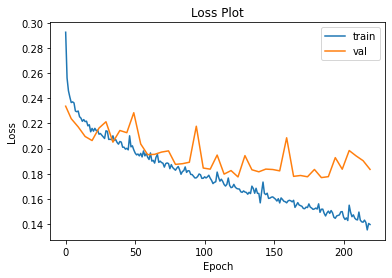
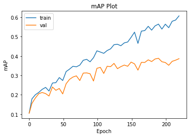

# Assignment 3 Part 1: Developing Your Own Classifier


```python
import os
import numpy as np
import torch
import torch.nn as nn
import torchvision

from torchvision import transforms
from sklearn.metrics import average_precision_score
from PIL import Image, ImageDraw
import matplotlib.pyplot as plt
from kaggle_submission import output_submission_csv
from classifier import SimpleClassifier, Classifier#, AlexNet
from voc_dataloader import VocDataset, VOC_CLASSES


%matplotlib inline
%load_ext autoreload
%autoreload 2
```


```python
torch.manual_seed(17)
```


    <torch._C.Generator at 0x7f619b5323f0>


# Part 1B: Design your own network

In this notebook, your task is to create and train your own model for multi-label classification on VOC Pascal.

## What to do
1. You will make change on network architecture in ```classifier.py```.
2. You may also want to change other hyperparameters to assist your training to get a better performances. Hints will be given in the below instructions.

## What to submit
Check the submission template for details what to submit. 


```python
def train_classifier(train_loader, classifier, criterion, optimizer):
    classifier.train()
    loss_ = 0.0
    losses = []
    for i, (images, labels) in enumerate(train_loader):
        images, labels = images.to(device), labels.to(device)
        optimizer.zero_grad()
        logits = classifier(images)
        loss = criterion(logits, labels)
        loss.backward()
        optimizer.step()
        losses.append(loss)
    return torch.stack(losses).mean().item()
```


```python
def test_classifier(test_loader, classifier, criterion, print_ind_classes=True, print_total=True):
    classifier.eval()
    losses = []
    with torch.no_grad():
        y_true = np.zeros((0,21))
        y_score = np.zeros((0,21))
        for i, (images, labels) in enumerate(test_loader):
            images, labels = images.to(device), labels.to(device)
            logits = classifier(images)
            y_true = np.concatenate((y_true, labels.cpu().numpy()), axis=0)
            y_score = np.concatenate((y_score, logits.cpu().numpy()), axis=0)
            loss = criterion(logits, labels)
            losses.append(loss.item())
        aps = []
        # ignore first class which is background
        for i in range(1, y_true.shape[1]):
            ap = average_precision_score(y_true[:, i], y_score[:, i])
            if print_ind_classes:
                print('-------  Class: {:<12}     AP: {:>8.4f}  -------'.format(VOC_CLASSES[i], ap))
            aps.append(ap)
        
        mAP = np.mean(aps)
        test_loss = np.mean(losses)
        if print_total:
            print('mAP: {0:.4f}'.format(mAP))
            print('Avg loss: {}'.format(test_loss))
        
    return mAP, test_loss, aps
```


```python
def plot_losses(train, val, test_frequency, num_epochs):
    plt.plot(train, label="train")
    indices = [i for i in range(num_epochs) if ((i+1)%test_frequency == 0 or i ==0)]
    plt.plot(indices, val, label="val")
    plt.title("Loss Plot")
    plt.ylabel("Loss")
    plt.xlabel("Epoch")
    plt.legend()
    plt.show()
    
def plot_mAP(train, val, test_frequency, num_epochs):
    indices = [i for i in range(num_epochs) if ((i+1)%test_frequency == 0 or i ==0)]
    plt.plot(indices, train, label="train")
    plt.plot(indices, val, label="val")
    plt.title("mAP Plot")
    plt.ylabel("mAP")
    plt.xlabel("Epoch")
    plt.legend()
    plt.show()
    
```


```python

def train(classifier, num_epochs, train_loader, val_loader, criterion, optimizer, test_frequency=5):
    train_losses = []
    train_mAPs = []
    val_losses = []
    val_mAPs = []

    for epoch in range(1,num_epochs+1):
        print("Starting epoch number " + str(epoch))
        train_loss = train_classifier(train_loader, classifier, criterion, optimizer)
        train_losses.append(train_loss)
        print("Loss for Training on Epoch " +str(epoch) + " is "+ str(train_loss))
        if(epoch%test_frequency==0 or epoch==1):
            mAP_train, _, _ = test_classifier(train_loader, classifier, criterion, False, False)
            train_mAPs.append(mAP_train)
            mAP_val, val_loss, _ = test_classifier(val_loader, classifier, criterion)
            print('Evaluating classifier')
            print("Mean Precision Score for Testing on Epoch " +str(epoch) + " is "+ str(mAP_val))
            val_losses.append(val_loss)
            val_mAPs.append(mAP_val)
    
    return classifier, train_losses, val_losses, train_mAPs, val_mAPs
```

# Developing Your Own Model

### Goal
To meet the benchmark for this assignment you will need to improve the network. Note you should have noticed pretrained Alenxt performs really well, but training Alexnet from scratch performs much worse. We hope you can design a better architecture over both the simple classifier and AlexNet to train from scratch.

### How to start
You may take inspiration from other published architectures and architectures discussed in lecture. However, you are NOT allowed to use predefined models (e.g. models from torchvision) or use pretrained weights. Training must be done from scratch with your own custom model.

#### Some hints
There are a variety of different approaches you should try to improve performance from the simple classifier:

* Network architecture changes
    * Number of layers: try adding layers to make your network deeper
    * Batch normalization: adding batch norm between layers will likely give you a significant performance increase
    * Residual connections: as you increase the depth of your network, you will find that having residual connections like those in ResNet architectures will be helpful
* Optimizer: Instead of plain SGD, you may want to add a learning rate schedule, add momentum, or use one of the other optimizers you have learned about like Adam. Check the `torch.optim` package for other optimizers
* Data augmentation: You should use the `torchvision.transforms` module to try adding random resized crops and horizontal flips of the input data. Check `transforms.RandomResizedCrop` and `transforms.RandomHorizontalFlip` for this. Feel free to apply more [transforms](https://pytorch.org/docs/stable/torchvision/transforms.html) for data augmentation which can lead to better performance. 
* Epochs: Once you have found a generally good hyperparameter setting try training for more epochs
* Loss function: You might want to add weighting to the `MultiLabelSoftMarginLoss` for classes that are less well represented or experiment with a different loss function


#### Note
We will soon be providing some initial expectations of mAP values as a function of epoch so you can get an early idea whether your implementation works without waiting a long time for training to converge.

### What to submit 
Submit your best model to Kaggle and save all plots for the writeup.


```python
device = torch.device("cuda:0" if torch.cuda.is_available() else "cpu")

normalize = transforms.Normalize(mean=[0.485, 0.456, 0.406],
                                     std= [0.229, 0.224, 0.225])

train_transform = transforms.Compose([
            transforms.Resize(227),
            transforms.CenterCrop(227),
            transforms.RandomResizedCrop(size=227, scale=(0.3,1)),
            transforms.RandomPerspective(),
            transforms.RandomHorizontalFlip(),
            transforms.RandomVerticalFlip(),
            transforms.RandomRotation(degrees=(-180,180)),
            transforms.ToTensor(),
            normalize
        ])

test_transform = transforms.Compose([
            transforms.Resize(227),
            transforms.CenterCrop(227),
            transforms.ToTensor(),
            normalize,
        ])

ds_train = VocDataset('VOCdevkit_2007/VOC2007/','train',train_transform)
ds_val = VocDataset('VOCdevkit_2007/VOC2007/','val',test_transform)
ds_test = VocDataset('VOCdevkit_2007/VOC2007test/','test', test_transform)

```

    /workspace/assignment3_part1/voc_dataloader.py:137: VisibleDeprecationWarning: Creating an ndarray from ragged nested sequences (which is a list-or-tuple of lists-or-tuples-or ndarrays with different lengths or shapes) is deprecated. If you meant to do this, you must specify 'dtype=object' when creating the ndarray.
      np.array(box_indices),


```python
num_epochs = 220
test_frequency = 5
batch_size = 64

train_loader = torch.utils.data.DataLoader(dataset=ds_train,
                                               batch_size=batch_size, 
                                               shuffle=True,
                                               num_workers=1)

val_loader = torch.utils.data.DataLoader(dataset=ds_val,
                                               batch_size=batch_size, 
                                               shuffle=True,
                                               num_workers=1)

test_loader = torch.utils.data.DataLoader(dataset=ds_test,
                                               batch_size=batch_size, 
                                               shuffle=False,
                                               num_workers=1)
```


```python
classifier = Classifier().to(device)
```


```python
print(classifier)
```

    Classifier(
      (conv1_1): Conv2d(3, 64, kernel_size=(3, 3), stride=(1, 1), padding=(1, 1))
      (conv1_bn1): BatchNorm2d(64, eps=1e-05, momentum=0.1, affine=True, track_running_stats=True)
      (conv1_2): Conv2d(64, 64, kernel_size=(3, 3), stride=(1, 1), padding=(1, 1))
      (conv1_bn2): BatchNorm2d(64, eps=1e-05, momentum=0.1, affine=True, track_running_stats=True)
      (conv1_pool): MaxPool2d(kernel_size=(2, 2), stride=(2, 2), padding=0, dilation=1, ceil_mode=False)
      (conv2_1): Conv2d(64, 128, kernel_size=(3, 3), stride=(1, 1), padding=(1, 1))
      (conv2_bn1): BatchNorm2d(128, eps=1e-05, momentum=0.1, affine=True, track_running_stats=True)
      (conv2_2): Conv2d(128, 128, kernel_size=(3, 3), stride=(1, 1), padding=(1, 1))
      (conv2_bn2): BatchNorm2d(128, eps=1e-05, momentum=0.1, affine=True, track_running_stats=True)
      (conv2_pool): MaxPool2d(kernel_size=(2, 2), stride=(2, 2), padding=0, dilation=1, ceil_mode=False)
      (conv3_1): Conv2d(128, 256, kernel_size=(3, 3), stride=(1, 1), padding=(1, 1))
      (conv3_bn1): BatchNorm2d(256, eps=1e-05, momentum=0.1, affine=True, track_running_stats=True)
      (conv3_2): Conv2d(256, 256, kernel_size=(3, 3), stride=(1, 1), padding=(1, 1))
      (conv3_bn2): BatchNorm2d(256, eps=1e-05, momentum=0.1, affine=True, track_running_stats=True)
      (conv3_3): Conv2d(256, 256, kernel_size=(3, 3), stride=(1, 1), padding=(1, 1))
      (conv3_bn3): BatchNorm2d(256, eps=1e-05, momentum=0.1, affine=True, track_running_stats=True)
      (conv3_4): Conv2d(256, 256, kernel_size=(3, 3), stride=(1, 1), padding=(1, 1))
      (conv3_bn4): BatchNorm2d(256, eps=1e-05, momentum=0.1, affine=True, track_running_stats=True)
      (conv3_pool): MaxPool2d(kernel_size=(2, 2), stride=(2, 2), padding=0, dilation=1, ceil_mode=False)
      (conv4_1): Conv2d(256, 512, kernel_size=(3, 3), stride=(1, 1), padding=(1, 1))
      (conv4_bn1): BatchNorm2d(512, eps=1e-05, momentum=0.1, affine=True, track_running_stats=True)
      (conv4_2): Conv2d(512, 512, kernel_size=(3, 3), stride=(1, 1), padding=(1, 1))
      (conv4_bn2): BatchNorm2d(512, eps=1e-05, momentum=0.1, affine=True, track_running_stats=True)
      (conv4_3): Conv2d(512, 512, kernel_size=(3, 3), stride=(1, 1), padding=(1, 1))
      (conv4_bn3): BatchNorm2d(512, eps=1e-05, momentum=0.1, affine=True, track_running_stats=True)
      (conv4_4): Conv2d(512, 512, kernel_size=(3, 3), stride=(1, 1), padding=(1, 1))
      (conv4_bn4): BatchNorm2d(512, eps=1e-05, momentum=0.1, affine=True, track_running_stats=True)
      (conv4_pool): MaxPool2d(kernel_size=(2, 2), stride=(2, 2), padding=0, dilation=1, ceil_mode=False)
      (conv5_1): Conv2d(512, 256, kernel_size=(1, 1), stride=(1, 1), padding=(1, 1))
      (conv5_bn1): BatchNorm2d(256, eps=1e-05, momentum=0.1, affine=True, track_running_stats=True)
      (conv5_2): Conv2d(256, 256, kernel_size=(1, 1), stride=(1, 1), padding=(1, 1))
      (conv5_bn2): BatchNorm2d(256, eps=1e-05, momentum=0.1, affine=True, track_running_stats=True)
      (conv5_3): Conv2d(256, 128, kernel_size=(1, 1), stride=(1, 1), padding=(1, 1))
      (conv5_bn3): BatchNorm2d(128, eps=1e-05, momentum=0.1, affine=True, track_running_stats=True)
      (conv5_4): Conv2d(128, 128, kernel_size=(1, 1), stride=(1, 1), padding=(1, 1))
      (conv5_bn4): BatchNorm2d(128, eps=1e-05, momentum=0.1, affine=True, track_running_stats=True)
      (conv5_pool): MaxPool2d(kernel_size=(2, 2), stride=(2, 2), padding=0, dilation=1, ceil_mode=False)
      (fc1): Linear(in_features=15488, out_features=4096, bias=True)
      (drop1): Dropout(p=0.5, inplace=False)
      (fc2): Linear(in_features=4096, out_features=512, bias=True)
      (drop2): Dropout(p=0.5, inplace=False)
      (fc3): Linear(in_features=512, out_features=21, bias=True)
    )


```python
# TODO: Run your own classifier here


criterion = nn.MultiLabelSoftMarginLoss()
# optimizer = torch.optim.SGD(classifier.parameters(), lr=0.01, momentum=0.9)
optimizer = torch.optim.Adam(classifier.parameters(), lr=1e-4)

classifier, train_losses, val_losses, train_mAPs, val_mAPs = train(classifier, num_epochs, train_loader, val_loader, criterion, optimizer, test_frequency)

```

    Starting epoch number 1
    Loss for Training on Epoch 1 is 0.2925189435482025
    -------  Class: aeroplane        AP:   0.1352  -------
    -------  Class: bicycle          AP:   0.1170  -------
    -------  Class: bird             AP:   0.0851  -------
    -------  Class: boat             AP:   0.0540  -------
    -------  Class: bottle           AP:   0.0495  -------
    -------  Class: bus              AP:   0.0580  -------
    -------  Class: car              AP:   0.1822  -------
    -------  Class: cat              AP:   0.0748  -------
    -------  Class: chair            AP:   0.1515  -------
    -------  Class: cow              AP:   0.0310  -------
    -------  Class: diningtable      AP:   0.0684  -------
    -------  Class: dog              AP:   0.1202  -------
    -------  Class: horse            AP:   0.0792  -------
    -------  Class: motorbike        AP:   0.0904  -------
    -------  Class: person           AP:   0.4459  -------
    -------  Class: pottedplant      AP:   0.1052  -------
    -------  Class: sheep            AP:   0.0205  -------
    -------  Class: sofa             AP:   0.0972  -------
    -------  Class: train            AP:   0.0862  -------
    -------  Class: tvmonitor        AP:   0.0454  -------
    mAP: 0.1048
    Avg loss: 0.23370145373046397
    Evaluating classifier
    Mean Precision Score for Testing on Epoch 1 is 0.10484885236046941
    Starting epoch number 2
    Loss for Training on Epoch 2 is 0.25612616539001465
    Starting epoch number 3
    Loss for Training on Epoch 3 is 0.2459503710269928
    Starting epoch number 4
    Loss for Training on Epoch 4 is 0.24100370705127716
    Starting epoch number 5
    Loss for Training on Epoch 5 is 0.23660384118556976
    -------  Class: aeroplane        AP:   0.3872  -------
    -------  Class: bicycle          AP:   0.0526  -------
    -------  Class: bird             AP:   0.1222  -------
    -------  Class: boat             AP:   0.1342  -------
    -------  Class: bottle           AP:   0.0844  -------
    -------  Class: bus              AP:   0.0565  -------
    -------  Class: car              AP:   0.2784  -------
    -------  Class: cat              AP:   0.1516  -------
    -------  Class: chair            AP:   0.2176  -------
    -------  Class: cow              AP:   0.0656  -------
    -------  Class: diningtable      AP:   0.1436  -------
    -------  Class: dog              AP:   0.1571  -------
    -------  Class: horse            AP:   0.1138  -------
    -------  Class: motorbike        AP:   0.1541  -------
    -------  Class: person           AP:   0.5465  -------
    -------  Class: pottedplant      AP:   0.0781  -------
    -------  Class: sheep            AP:   0.0544  -------
    -------  Class: sofa             AP:   0.1469  -------
    -------  Class: train            AP:   0.1021  -------
    -------  Class: tvmonitor        AP:   0.0677  -------
    mAP: 0.1557
    Avg loss: 0.22377230487763883
    Evaluating classifier
    Mean Precision Score for Testing on Epoch 5 is 0.15572924612669997
    Starting epoch number 6
    Loss for Training on Epoch 6 is 0.23714704811573029
    Starting epoch number 7
    Loss for Training on Epoch 7 is 0.2362990379333496
    Starting epoch number 8
    Loss for Training on Epoch 8 is 0.2298543006181717
    Starting epoch number 9
    Loss for Training on Epoch 9 is 0.2293018400669098
    Starting epoch number 10
    Loss for Training on Epoch 10 is 0.2298445999622345
    -------  Class: aeroplane        AP:   0.3792  -------
    -------  Class: bicycle          AP:   0.0641  -------
    -------  Class: bird             AP:   0.1277  -------
    -------  Class: boat             AP:   0.2276  -------
    -------  Class: bottle           AP:   0.0917  -------
    -------  Class: bus              AP:   0.0828  -------
    -------  Class: car              AP:   0.2786  -------
    -------  Class: cat              AP:   0.2257  -------
    -------  Class: chair            AP:   0.2505  -------
    -------  Class: cow              AP:   0.0545  -------
    -------  Class: diningtable      AP:   0.1840  -------
    -------  Class: dog              AP:   0.1606  -------
    -------  Class: horse            AP:   0.1943  -------
    -------  Class: motorbike        AP:   0.1176  -------
    -------  Class: person           AP:   0.5955  -------
    -------  Class: pottedplant      AP:   0.1157  -------
    -------  Class: sheep            AP:   0.1267  -------
    -------  Class: sofa             AP:   0.1703  -------
    -------  Class: train            AP:   0.1389  -------
    -------  Class: tvmonitor        AP:   0.0844  -------
    mAP: 0.1835
    Avg loss: 0.2172641832381487
    Evaluating classifier
    Mean Precision Score for Testing on Epoch 10 is 0.18351427416742636
    Starting epoch number 11
    Loss for Training on Epoch 11 is 0.22531871497631073
    Starting epoch number 12
    Loss for Training on Epoch 12 is 0.2242054045200348
    Starting epoch number 13
    Loss for Training on Epoch 13 is 0.22167007625102997
    Starting epoch number 14
    Loss for Training on Epoch 14 is 0.22305893898010254
    Starting epoch number 15
    Loss for Training on Epoch 15 is 0.2214478701353073
    -------  Class: aeroplane        AP:   0.4072  -------
    -------  Class: bicycle          AP:   0.1066  -------
    -------  Class: bird             AP:   0.1493  -------
    -------  Class: boat             AP:   0.1788  -------
    -------  Class: bottle           AP:   0.1148  -------
    -------  Class: bus              AP:   0.0956  -------
    -------  Class: car              AP:   0.3342  -------
    -------  Class: cat              AP:   0.2363  -------
    -------  Class: chair            AP:   0.2627  -------
    -------  Class: cow              AP:   0.0627  -------
    -------  Class: diningtable      AP:   0.2022  -------
    -------  Class: dog              AP:   0.1743  -------
    -------  Class: horse            AP:   0.3062  -------
    -------  Class: motorbike        AP:   0.1827  -------
    -------  Class: person           AP:   0.6454  -------
    -------  Class: pottedplant      AP:   0.1062  -------
    -------  Class: sheep            AP:   0.1475  -------
    -------  Class: sofa             AP:   0.1958  -------
    -------  Class: train            AP:   0.1213  -------
    -------  Class: tvmonitor        AP:   0.0896  -------
    mAP: 0.2060
    Avg loss: 0.2096069749444723
    Evaluating classifier
    Mean Precision Score for Testing on Epoch 15 is 0.2059720416130401
    Starting epoch number 16
    Loss for Training on Epoch 16 is 0.22179169952869415
    Starting epoch number 17
    Loss for Training on Epoch 17 is 0.2180866301059723
    Starting epoch number 18
    Loss for Training on Epoch 18 is 0.21895694732666016
    Starting epoch number 19
    Loss for Training on Epoch 19 is 0.21334193646907806
    Starting epoch number 20
    Loss for Training on Epoch 20 is 0.2160310596227646
    -------  Class: aeroplane        AP:   0.4237  -------
    -------  Class: bicycle          AP:   0.0999  -------
    -------  Class: bird             AP:   0.1393  -------
    -------  Class: boat             AP:   0.1732  -------
    -------  Class: bottle           AP:   0.1226  -------
    -------  Class: bus              AP:   0.0828  -------
    -------  Class: car              AP:   0.3699  -------
    -------  Class: cat              AP:   0.2145  -------
    -------  Class: chair            AP:   0.2541  -------
    -------  Class: cow              AP:   0.0705  -------
    -------  Class: diningtable      AP:   0.1690  -------
    -------  Class: dog              AP:   0.1749  -------
    -------  Class: horse            AP:   0.3425  -------
    -------  Class: motorbike        AP:   0.2112  -------
    -------  Class: person           AP:   0.6947  -------
    -------  Class: pottedplant      AP:   0.1310  -------
    -------  Class: sheep            AP:   0.1357  -------
    -------  Class: sofa             AP:   0.1781  -------
    -------  Class: train            AP:   0.1577  -------
    -------  Class: tvmonitor        AP:   0.0973  -------
    mAP: 0.2121
    Avg loss: 0.206390580534935
    Evaluating classifier
    Mean Precision Score for Testing on Epoch 20 is 0.21212866413842532
    Starting epoch number 21
    Loss for Training on Epoch 21 is 0.21386483311653137
    Starting epoch number 22
    Loss for Training on Epoch 22 is 0.21611249446868896
    Starting epoch number 23
    Loss for Training on Epoch 23 is 0.21426840126514435
    Starting epoch number 24
    Loss for Training on Epoch 24 is 0.21454186737537384
    Starting epoch number 25
    Loss for Training on Epoch 25 is 0.21143603324890137
    -------  Class: aeroplane        AP:   0.4560  -------
    -------  Class: bicycle          AP:   0.0762  -------
    -------  Class: bird             AP:   0.1169  -------
    -------  Class: boat             AP:   0.1760  -------
    -------  Class: bottle           AP:   0.1225  -------
    -------  Class: bus              AP:   0.0978  -------
    -------  Class: car              AP:   0.3473  -------
    -------  Class: cat              AP:   0.2270  -------
    -------  Class: chair            AP:   0.3000  -------
    -------  Class: cow              AP:   0.0681  -------
    -------  Class: diningtable      AP:   0.2521  -------
    -------  Class: dog              AP:   0.1621  -------
    -------  Class: horse            AP:   0.2997  -------
    -------  Class: motorbike        AP:   0.0988  -------
    -------  Class: person           AP:   0.6326  -------
    -------  Class: pottedplant      AP:   0.1207  -------
    -------  Class: sheep            AP:   0.1181  -------
    -------  Class: sofa             AP:   0.2048  -------
    -------  Class: train            AP:   0.1514  -------
    -------  Class: tvmonitor        AP:   0.1020  -------
    mAP: 0.2065
    Avg loss: 0.2163195051252842
    Evaluating classifier
    Mean Precision Score for Testing on Epoch 25 is 0.20651146893341893
    Starting epoch number 26
    Loss for Training on Epoch 26 is 0.2119547575712204
    Starting epoch number 27
    Loss for Training on Epoch 27 is 0.21065738797187805
    Starting epoch number 28
    Loss for Training on Epoch 28 is 0.20945976674556732
    Starting epoch number 29
    Loss for Training on Epoch 29 is 0.2080259770154953
    Starting epoch number 30
    Loss for Training on Epoch 30 is 0.21413026750087738
    -------  Class: aeroplane        AP:   0.3852  -------
    -------  Class: bicycle          AP:   0.0773  -------
    -------  Class: bird             AP:   0.1512  -------
    -------  Class: boat             AP:   0.1657  -------
    -------  Class: bottle           AP:   0.1187  -------
    -------  Class: bus              AP:   0.0867  -------
    -------  Class: car              AP:   0.3141  -------
    -------  Class: cat              AP:   0.2435  -------
    -------  Class: chair            AP:   0.2448  -------
    -------  Class: cow              AP:   0.0765  -------
    -------  Class: diningtable      AP:   0.1661  -------
    -------  Class: dog              AP:   0.1908  -------
    -------  Class: horse            AP:   0.2422  -------
    -------  Class: motorbike        AP:   0.1618  -------
    -------  Class: person           AP:   0.5914  -------
    -------  Class: pottedplant      AP:   0.1387  -------
    -------  Class: sheep            AP:   0.1433  -------
    -------  Class: sofa             AP:   0.1924  -------
    -------  Class: train            AP:   0.1011  -------
    -------  Class: tvmonitor        AP:   0.0874  -------
    mAP: 0.1939
    Avg loss: 0.22133502922952175
    Evaluating classifier
    Mean Precision Score for Testing on Epoch 30 is 0.19394395558547042
    Starting epoch number 31
    Loss for Training on Epoch 31 is 0.21375472843647003
    Starting epoch number 32
    Loss for Training on Epoch 32 is 0.2072724550962448
    Starting epoch number 33
    Loss for Training on Epoch 33 is 0.20740798115730286
    Starting epoch number 34
    Loss for Training on Epoch 34 is 0.2070954144001007
    Starting epoch number 35
    Loss for Training on Epoch 35 is 0.21015672385692596
    -------  Class: aeroplane        AP:   0.4367  -------
    -------  Class: bicycle          AP:   0.1497  -------
    -------  Class: bird             AP:   0.1464  -------
    -------  Class: boat             AP:   0.1274  -------
    -------  Class: bottle           AP:   0.1484  -------
    -------  Class: bus              AP:   0.1115  -------
    -------  Class: car              AP:   0.4134  -------
    -------  Class: cat              AP:   0.2620  -------
    -------  Class: chair            AP:   0.2933  -------
    -------  Class: cow              AP:   0.0821  -------
    -------  Class: diningtable      AP:   0.2605  -------
    -------  Class: dog              AP:   0.1716  -------
    -------  Class: horse            AP:   0.3787  -------
    -------  Class: motorbike        AP:   0.2887  -------
    -------  Class: person           AP:   0.7170  -------
    -------  Class: pottedplant      AP:   0.1195  -------
    -------  Class: sheep            AP:   0.1275  -------
    -------  Class: sofa             AP:   0.2136  -------
    -------  Class: train            AP:   0.2504  -------
    -------  Class: tvmonitor        AP:   0.1141  -------
    mAP: 0.2406
    Avg loss: 0.20513488464057444
    Evaluating classifier
    Mean Precision Score for Testing on Epoch 35 is 0.24061798644374455
    Starting epoch number 36
    Loss for Training on Epoch 36 is 0.20654891431331635
    Starting epoch number 37
    Loss for Training on Epoch 37 is 0.20717106759548187
    Starting epoch number 38
    Loss for Training on Epoch 38 is 0.204878568649292
    Starting epoch number 39
    Loss for Training on Epoch 39 is 0.20350180566310883
    Starting epoch number 40
    Loss for Training on Epoch 40 is 0.2056141346693039
    -------  Class: aeroplane        AP:   0.4632  -------
    -------  Class: bicycle          AP:   0.0874  -------
    -------  Class: bird             AP:   0.1499  -------
    -------  Class: boat             AP:   0.2117  -------
    -------  Class: bottle           AP:   0.0996  -------
    -------  Class: bus              AP:   0.0999  -------
    -------  Class: car              AP:   0.3959  -------
    -------  Class: cat              AP:   0.2450  -------
    -------  Class: chair            AP:   0.3127  -------
    -------  Class: cow              AP:   0.0739  -------
    -------  Class: diningtable      AP:   0.1655  -------
    -------  Class: dog              AP:   0.2023  -------
    -------  Class: horse            AP:   0.2918  -------
    -------  Class: motorbike        AP:   0.2475  -------
    -------  Class: person           AP:   0.7037  -------
    -------  Class: pottedplant      AP:   0.1210  -------
    -------  Class: sheep            AP:   0.1535  -------
    -------  Class: sofa             AP:   0.2124  -------
    -------  Class: train            AP:   0.1368  -------
    -------  Class: tvmonitor        AP:   0.0939  -------
    mAP: 0.2234
    Avg loss: 0.21437875889241695
    Evaluating classifier
    Mean Precision Score for Testing on Epoch 40 is 0.22338192878785185
    Starting epoch number 41
    Loss for Training on Epoch 41 is 0.20516467094421387
    Starting epoch number 42
    Loss for Training on Epoch 42 is 0.20106247067451477
    Starting epoch number 43
    Loss for Training on Epoch 43 is 0.20113728940486908
    Starting epoch number 44
    Loss for Training on Epoch 44 is 0.19956214725971222
    Starting epoch number 45
    Loss for Training on Epoch 45 is 0.20022426545619965
    -------  Class: aeroplane        AP:   0.4896  -------
    -------  Class: bicycle          AP:   0.0735  -------
    -------  Class: bird             AP:   0.1455  -------
    -------  Class: boat             AP:   0.2104  -------
    -------  Class: bottle           AP:   0.1336  -------
    -------  Class: bus              AP:   0.1032  -------
    -------  Class: car              AP:   0.4038  -------
    -------  Class: cat              AP:   0.3160  -------
    -------  Class: chair            AP:   0.3001  -------
    -------  Class: cow              AP:   0.0722  -------
    -------  Class: diningtable      AP:   0.2356  -------
    -------  Class: dog              AP:   0.2015  -------
    -------  Class: horse            AP:   0.3496  -------
    -------  Class: motorbike        AP:   0.1147  -------
    -------  Class: person           AP:   0.7071  -------
    -------  Class: pottedplant      AP:   0.1495  -------
    -------  Class: sheep            AP:   0.1156  -------
    -------  Class: sofa             AP:   0.1853  -------
    -------  Class: train            AP:   0.2418  -------
    -------  Class: tvmonitor        AP:   0.1085  -------
    mAP: 0.2329
    Avg loss: 0.2126306150108576
    Evaluating classifier
    Mean Precision Score for Testing on Epoch 45 is 0.2328600167515574
    Starting epoch number 46
    Loss for Training on Epoch 46 is 0.19898849725723267
    Starting epoch number 47
    Loss for Training on Epoch 47 is 0.21017256379127502
    Starting epoch number 48
    Loss for Training on Epoch 48 is 0.2013702392578125
    Starting epoch number 49
    Loss for Training on Epoch 49 is 0.20219166576862335
    Starting epoch number 50
    Loss for Training on Epoch 50 is 0.19899332523345947
    -------  Class: aeroplane        AP:   0.4738  -------
    -------  Class: bicycle          AP:   0.0517  -------
    -------  Class: bird             AP:   0.1295  -------
    -------  Class: boat             AP:   0.1369  -------
    -------  Class: bottle           AP:   0.1020  -------
    -------  Class: bus              AP:   0.0633  -------
    -------  Class: car              AP:   0.3561  -------
    -------  Class: cat              AP:   0.3049  -------
    -------  Class: chair            AP:   0.2553  -------
    -------  Class: cow              AP:   0.0874  -------
    -------  Class: diningtable      AP:   0.1603  -------
    -------  Class: dog              AP:   0.2390  -------
    -------  Class: horse            AP:   0.2194  -------
    -------  Class: motorbike        AP:   0.0599  -------
    -------  Class: person           AP:   0.6847  -------
    -------  Class: pottedplant      AP:   0.0873  -------
    -------  Class: sheep            AP:   0.1691  -------
    -------  Class: sofa             AP:   0.1978  -------
    -------  Class: train            AP:   0.2219  -------
    -------  Class: tvmonitor        AP:   0.0965  -------
    mAP: 0.2048
    Avg loss: 0.2285123836249113
    Evaluating classifier
    Mean Precision Score for Testing on Epoch 50 is 0.20483560921737332
    Starting epoch number 51
    Loss for Training on Epoch 51 is 0.1964704841375351
    Starting epoch number 52
    Loss for Training on Epoch 52 is 0.19498899579048157
    Starting epoch number 53
    Loss for Training on Epoch 53 is 0.1956622302532196
    Starting epoch number 54
    Loss for Training on Epoch 54 is 0.1941804736852646
    Starting epoch number 55
    Loss for Training on Epoch 55 is 0.19618363678455353
    -------  Class: aeroplane        AP:   0.4908  -------
    -------  Class: bicycle          AP:   0.0779  -------
    -------  Class: bird             AP:   0.1713  -------
    -------  Class: boat             AP:   0.1794  -------
    -------  Class: bottle           AP:   0.1258  -------
    -------  Class: bus              AP:   0.1295  -------
    -------  Class: car              AP:   0.3736  -------
    -------  Class: cat              AP:   0.3116  -------
    -------  Class: chair            AP:   0.3527  -------
    -------  Class: cow              AP:   0.0744  -------
    -------  Class: diningtable      AP:   0.2730  -------
    -------  Class: dog              AP:   0.2392  -------
    -------  Class: horse            AP:   0.3884  -------
    -------  Class: motorbike        AP:   0.2427  -------
    -------  Class: person           AP:   0.7427  -------
    -------  Class: pottedplant      AP:   0.1760  -------
    -------  Class: sheep            AP:   0.1220  -------
    -------  Class: sofa             AP:   0.2487  -------
    -------  Class: train            AP:   0.2909  -------
    -------  Class: tvmonitor        AP:   0.1326  -------
    mAP: 0.2572
    Avg loss: 0.20364508889615535
    Evaluating classifier
    Mean Precision Score for Testing on Epoch 55 is 0.2571640027486515
    Starting epoch number 56
    Loss for Training on Epoch 56 is 0.1933538019657135
    Starting epoch number 57
    Loss for Training on Epoch 57 is 0.19811920821666718
    Starting epoch number 58
    Loss for Training on Epoch 58 is 0.19420532882213593
    Starting epoch number 59
    Loss for Training on Epoch 59 is 0.19613681733608246
    Starting epoch number 60
    Loss for Training on Epoch 60 is 0.1930803805589676
    -------  Class: aeroplane        AP:   0.4758  -------
    -------  Class: bicycle          AP:   0.1184  -------
    -------  Class: bird             AP:   0.1710  -------
    -------  Class: boat             AP:   0.2340  -------
    -------  Class: bottle           AP:   0.1519  -------
    -------  Class: bus              AP:   0.1300  -------
    -------  Class: car              AP:   0.4572  -------
    -------  Class: cat              AP:   0.3086  -------
    -------  Class: chair            AP:   0.3823  -------
    -------  Class: cow              AP:   0.0852  -------
    -------  Class: diningtable      AP:   0.2977  -------
    -------  Class: dog              AP:   0.2076  -------
    -------  Class: horse            AP:   0.4365  -------
    -------  Class: motorbike        AP:   0.2703  -------
    -------  Class: person           AP:   0.7612  -------
    -------  Class: pottedplant      AP:   0.2012  -------
    -------  Class: sheep            AP:   0.1509  -------
    -------  Class: sofa             AP:   0.2761  -------
    -------  Class: train            AP:   0.3132  -------
    -------  Class: tvmonitor        AP:   0.1668  -------
    mAP: 0.2798
    Avg loss: 0.1951543226838112
    Evaluating classifier
    Mean Precision Score for Testing on Epoch 60 is 0.27980114045299354
    Starting epoch number 61
    Loss for Training on Epoch 61 is 0.1913294643163681
    Starting epoch number 62
    Loss for Training on Epoch 62 is 0.1965252012014389
    Starting epoch number 63
    Loss for Training on Epoch 63 is 0.19002629816532135
    Starting epoch number 64
    Loss for Training on Epoch 64 is 0.19061173498630524
    Starting epoch number 65
    Loss for Training on Epoch 65 is 0.1884617805480957
    -------  Class: aeroplane        AP:   0.5158  -------
    -------  Class: bicycle          AP:   0.1677  -------
    -------  Class: bird             AP:   0.1921  -------
    -------  Class: boat             AP:   0.2659  -------
    -------  Class: bottle           AP:   0.1313  -------
    -------  Class: bus              AP:   0.1626  -------
    -------  Class: car              AP:   0.4621  -------
    -------  Class: cat              AP:   0.3387  -------
    -------  Class: chair            AP:   0.3788  -------
    -------  Class: cow              AP:   0.0874  -------
    -------  Class: diningtable      AP:   0.2979  -------
    -------  Class: dog              AP:   0.2425  -------
    -------  Class: horse            AP:   0.3974  -------
    -------  Class: motorbike        AP:   0.2785  -------
    -------  Class: person           AP:   0.7621  -------
    -------  Class: pottedplant      AP:   0.2004  -------
    -------  Class: sheep            AP:   0.1850  -------
    -------  Class: sofa             AP:   0.2631  -------
    -------  Class: train            AP:   0.2982  -------
    -------  Class: tvmonitor        AP:   0.2090  -------
    mAP: 0.2918
    Avg loss: 0.19540488645434378
    Evaluating classifier
    Mean Precision Score for Testing on Epoch 65 is 0.2918282374438242
    Starting epoch number 66
    Loss for Training on Epoch 66 is 0.19305302202701569
    Starting epoch number 67
    Loss for Training on Epoch 67 is 0.195455864071846
    Starting epoch number 68
    Loss for Training on Epoch 68 is 0.18901410698890686
    Starting epoch number 69
    Loss for Training on Epoch 69 is 0.18997596204280853
    Starting epoch number 70
    Loss for Training on Epoch 70 is 0.18888311088085175
    -------  Class: aeroplane        AP:   0.4928  -------
    -------  Class: bicycle          AP:   0.1597  -------
    -------  Class: bird             AP:   0.1927  -------
    -------  Class: boat             AP:   0.3066  -------
    -------  Class: bottle           AP:   0.1196  -------
    -------  Class: bus              AP:   0.1604  -------
    -------  Class: car              AP:   0.4462  -------
    -------  Class: cat              AP:   0.3454  -------
    -------  Class: chair            AP:   0.3996  -------
    -------  Class: cow              AP:   0.0783  -------
    -------  Class: diningtable      AP:   0.2865  -------
    -------  Class: dog              AP:   0.2281  -------
    -------  Class: horse            AP:   0.3765  -------
    -------  Class: motorbike        AP:   0.4011  -------
    -------  Class: person           AP:   0.7569  -------
    -------  Class: pottedplant      AP:   0.2441  -------
    -------  Class: sheep            AP:   0.1802  -------
    -------  Class: sofa             AP:   0.2104  -------
    -------  Class: train            AP:   0.3554  -------
    -------  Class: tvmonitor        AP:   0.2161  -------
    mAP: 0.2978
    Avg loss: 0.19721623361110688
    Evaluating classifier
    Mean Precision Score for Testing on Epoch 70 is 0.2978283142861796
    Starting epoch number 71
    Loss for Training on Epoch 71 is 0.18835726380348206
    Starting epoch number 72
    Loss for Training on Epoch 72 is 0.18525883555412292
    Starting epoch number 73
    Loss for Training on Epoch 73 is 0.1880384236574173
    Starting epoch number 74
    Loss for Training on Epoch 74 is 0.1885732263326645
    Starting epoch number 75
    Loss for Training on Epoch 75 is 0.1880684643983841
    -------  Class: aeroplane        AP:   0.5147  -------
    -------  Class: bicycle          AP:   0.1326  -------
    -------  Class: bird             AP:   0.1569  -------
    -------  Class: boat             AP:   0.2524  -------
    -------  Class: bottle           AP:   0.1131  -------
    -------  Class: bus              AP:   0.1163  -------
    -------  Class: car              AP:   0.4216  -------
    -------  Class: cat              AP:   0.3367  -------
    -------  Class: chair            AP:   0.3405  -------
    -------  Class: cow              AP:   0.0917  -------
    -------  Class: diningtable      AP:   0.2506  -------
    -------  Class: dog              AP:   0.2613  -------
    -------  Class: horse            AP:   0.3881  -------
    -------  Class: motorbike        AP:   0.2305  -------
    -------  Class: person           AP:   0.7799  -------
    -------  Class: pottedplant      AP:   0.1785  -------
    -------  Class: sheep            AP:   0.1823  -------
    -------  Class: sofa             AP:   0.2325  -------
    -------  Class: train            AP:   0.3467  -------
    -------  Class: tvmonitor        AP:   0.1462  -------
    mAP: 0.2737
    Avg loss: 0.19817063361406326
    Evaluating classifier
    Mean Precision Score for Testing on Epoch 75 is 0.2736520757876445
    Starting epoch number 76
    Loss for Training on Epoch 76 is 0.18400278687477112
    Starting epoch number 77
    Loss for Training on Epoch 77 is 0.18722134828567505
    Starting epoch number 78
    Loss for Training on Epoch 78 is 0.18495237827301025
    Starting epoch number 79
    Loss for Training on Epoch 79 is 0.1837991327047348
    Starting epoch number 80
    Loss for Training on Epoch 80 is 0.1827940046787262
    -------  Class: aeroplane        AP:   0.5190  -------
    -------  Class: bicycle          AP:   0.2029  -------
    -------  Class: bird             AP:   0.2245  -------
    -------  Class: boat             AP:   0.2437  -------
    -------  Class: bottle           AP:   0.1381  -------
    -------  Class: bus              AP:   0.1492  -------
    -------  Class: car              AP:   0.5318  -------
    -------  Class: cat              AP:   0.3384  -------
    -------  Class: chair            AP:   0.3984  -------
    -------  Class: cow              AP:   0.0938  -------
    -------  Class: diningtable      AP:   0.3422  -------
    -------  Class: dog              AP:   0.2726  -------
    -------  Class: horse            AP:   0.3964  -------
    -------  Class: motorbike        AP:   0.3910  -------
    -------  Class: person           AP:   0.7851  -------
    -------  Class: pottedplant      AP:   0.2027  -------
    -------  Class: sheep            AP:   0.1938  -------
    -------  Class: sofa             AP:   0.2455  -------
    -------  Class: train            AP:   0.3568  -------
    -------  Class: tvmonitor        AP:   0.2149  -------
    mAP: 0.3120
    Avg loss: 0.1874357733875513
    Evaluating classifier
    Mean Precision Score for Testing on Epoch 80 is 0.31204284292321627
    Starting epoch number 81
    Loss for Training on Epoch 81 is 0.18449459969997406
    Starting epoch number 82
    Loss for Training on Epoch 82 is 0.185738667845726
    Starting epoch number 83
    Loss for Training on Epoch 83 is 0.18310581147670746
    Starting epoch number 84
    Loss for Training on Epoch 84 is 0.17955508828163147
    Starting epoch number 85
    Loss for Training on Epoch 85 is 0.18172632157802582
    -------  Class: aeroplane        AP:   0.5147  -------
    -------  Class: bicycle          AP:   0.2005  -------
    -------  Class: bird             AP:   0.2273  -------
    -------  Class: boat             AP:   0.2958  -------
    -------  Class: bottle           AP:   0.1201  -------
    -------  Class: bus              AP:   0.1315  -------
    -------  Class: car              AP:   0.4950  -------
    -------  Class: cat              AP:   0.3228  -------
    -------  Class: chair            AP:   0.4156  -------
    -------  Class: cow              AP:   0.0908  -------
    -------  Class: diningtable      AP:   0.3501  -------
    -------  Class: dog              AP:   0.2402  -------
    -------  Class: horse            AP:   0.4227  -------
    -------  Class: motorbike        AP:   0.4220  -------
    -------  Class: person           AP:   0.7791  -------
    -------  Class: pottedplant      AP:   0.2362  -------
    -------  Class: sheep            AP:   0.1940  -------
    -------  Class: sofa             AP:   0.2445  -------
    -------  Class: train            AP:   0.3484  -------
    -------  Class: tvmonitor        AP:   0.2113  -------
    mAP: 0.3131
    Avg loss: 0.18796622566878796
    Evaluating classifier
    Mean Precision Score for Testing on Epoch 85 is 0.31313095069909025
    Starting epoch number 86
    Loss for Training on Epoch 86 is 0.18246081471443176
    Starting epoch number 87
    Loss for Training on Epoch 87 is 0.18540893495082855
    Starting epoch number 88
    Loss for Training on Epoch 88 is 0.1810510903596878
    Starting epoch number 89
    Loss for Training on Epoch 89 is 0.18239746987819672
    Starting epoch number 90
    Loss for Training on Epoch 90 is 0.18225185573101044
    -------  Class: aeroplane        AP:   0.5077  -------
    -------  Class: bicycle          AP:   0.1770  -------
    -------  Class: bird             AP:   0.2426  -------
    -------  Class: boat             AP:   0.2361  -------
    -------  Class: bottle           AP:   0.1427  -------
    -------  Class: bus              AP:   0.1118  -------
    -------  Class: car              AP:   0.4711  -------
    -------  Class: cat              AP:   0.3398  -------
    -------  Class: chair            AP:   0.4172  -------
    -------  Class: cow              AP:   0.0987  -------
    -------  Class: diningtable      AP:   0.3499  -------
    -------  Class: dog              AP:   0.2735  -------
    -------  Class: horse            AP:   0.4253  -------
    -------  Class: motorbike        AP:   0.4155  -------
    -------  Class: person           AP:   0.7988  -------
    -------  Class: pottedplant      AP:   0.1953  -------
    -------  Class: sheep            AP:   0.1829  -------
    -------  Class: sofa             AP:   0.2168  -------
    -------  Class: train            AP:   0.3399  -------
    -------  Class: tvmonitor        AP:   0.2325  -------
    mAP: 0.3088
    Avg loss: 0.18912985026836396
    Evaluating classifier
    Mean Precision Score for Testing on Epoch 90 is 0.3087544722820693
    Starting epoch number 91
    Loss for Training on Epoch 91 is 0.1794406920671463
    Starting epoch number 92
    Loss for Training on Epoch 92 is 0.17933619022369385
    Starting epoch number 93
    Loss for Training on Epoch 93 is 0.17795097827911377
    Starting epoch number 94
    Loss for Training on Epoch 94 is 0.17659930884838104
    Starting epoch number 95
    Loss for Training on Epoch 95 is 0.17674197256565094
    -------  Class: aeroplane        AP:   0.5426  -------
    -------  Class: bicycle          AP:   0.0982  -------
    -------  Class: bird             AP:   0.1860  -------
    -------  Class: boat             AP:   0.2888  -------
    -------  Class: bottle           AP:   0.1103  -------
    -------  Class: bus              AP:   0.0849  -------
    -------  Class: car              AP:   0.4557  -------
    -------  Class: cat              AP:   0.3489  -------
    -------  Class: chair            AP:   0.3289  -------
    -------  Class: cow              AP:   0.0855  -------
    -------  Class: diningtable      AP:   0.2692  -------
    -------  Class: dog              AP:   0.2697  -------
    -------  Class: horse            AP:   0.3169  -------
    -------  Class: motorbike        AP:   0.1721  -------
    -------  Class: person           AP:   0.7383  -------
    -------  Class: pottedplant      AP:   0.1526  -------
    -------  Class: sheep            AP:   0.2075  -------
    -------  Class: sofa             AP:   0.2689  -------
    -------  Class: train            AP:   0.3593  -------
    -------  Class: tvmonitor        AP:   0.1403  -------
    mAP: 0.2712
    Avg loss: 0.21776705421507359
    Evaluating classifier
    Mean Precision Score for Testing on Epoch 95 is 0.27121977669400305
    Starting epoch number 96
    Loss for Training on Epoch 96 is 0.1778525561094284
    Starting epoch number 97
    Loss for Training on Epoch 97 is 0.17980550229549408
    Starting epoch number 98
    Loss for Training on Epoch 98 is 0.17916999757289886
    Starting epoch number 99
    Loss for Training on Epoch 99 is 0.17632070183753967
    Starting epoch number 100
    Loss for Training on Epoch 100 is 0.1763889342546463
    -------  Class: aeroplane        AP:   0.5585  -------
    -------  Class: bicycle          AP:   0.2113  -------
    -------  Class: bird             AP:   0.2029  -------
    -------  Class: boat             AP:   0.3375  -------
    -------  Class: bottle           AP:   0.1320  -------
    -------  Class: bus              AP:   0.2066  -------
    -------  Class: car              AP:   0.5393  -------
    -------  Class: cat              AP:   0.3721  -------
    -------  Class: chair            AP:   0.4327  -------
    -------  Class: cow              AP:   0.0964  -------
    -------  Class: diningtable      AP:   0.3633  -------
    -------  Class: dog              AP:   0.2919  -------
    -------  Class: horse            AP:   0.4579  -------
    -------  Class: motorbike        AP:   0.4810  -------
    -------  Class: person           AP:   0.8057  -------
    -------  Class: pottedplant      AP:   0.2223  -------
    -------  Class: sheep            AP:   0.1710  -------
    -------  Class: sofa             AP:   0.2461  -------
    -------  Class: train            AP:   0.3850  -------
    -------  Class: tvmonitor        AP:   0.2206  -------
    mAP: 0.3367
    Avg loss: 0.18452093973755837
    Evaluating classifier
    Mean Precision Score for Testing on Epoch 100 is 0.33671495364999204
    Starting epoch number 101
    Loss for Training on Epoch 101 is 0.17753233015537262
    Starting epoch number 102
    Loss for Training on Epoch 102 is 0.1766238957643509
    Starting epoch number 103
    Loss for Training on Epoch 103 is 0.17749325931072235
    Starting epoch number 104
    Loss for Training on Epoch 104 is 0.1787945032119751
    Starting epoch number 105
    Loss for Training on Epoch 105 is 0.1764296591281891
    -------  Class: aeroplane        AP:   0.5839  -------
    -------  Class: bicycle          AP:   0.2151  -------
    -------  Class: bird             AP:   0.2165  -------
    -------  Class: boat             AP:   0.3741  -------
    -------  Class: bottle           AP:   0.1469  -------
    -------  Class: bus              AP:   0.1782  -------
    -------  Class: car              AP:   0.5453  -------
    -------  Class: cat              AP:   0.3661  -------
    -------  Class: chair            AP:   0.4130  -------
    -------  Class: cow              AP:   0.1159  -------
    -------  Class: diningtable      AP:   0.3811  -------
    -------  Class: dog              AP:   0.2678  -------
    -------  Class: horse            AP:   0.4675  -------
    -------  Class: motorbike        AP:   0.5398  -------
    -------  Class: person           AP:   0.8003  -------
    -------  Class: pottedplant      AP:   0.2100  -------
    -------  Class: sheep            AP:   0.1732  -------
    -------  Class: sofa             AP:   0.2316  -------
    -------  Class: train            AP:   0.4181  -------
    -------  Class: tvmonitor        AP:   0.1886  -------
    mAP: 0.3416
    Avg loss: 0.18362870253622532
    Evaluating classifier
    Mean Precision Score for Testing on Epoch 105 is 0.3416405230396874
    Starting epoch number 106
    Loss for Training on Epoch 106 is 0.17466728389263153
    Starting epoch number 107
    Loss for Training on Epoch 107 is 0.17214420437812805
    Starting epoch number 108
    Loss for Training on Epoch 108 is 0.1731700897216797
    Starting epoch number 109
    Loss for Training on Epoch 109 is 0.17357270419597626
    Starting epoch number 110
    Loss for Training on Epoch 110 is 0.18130990862846375
    -------  Class: aeroplane        AP:   0.5262  -------
    -------  Class: bicycle          AP:   0.1161  -------
    -------  Class: bird             AP:   0.2448  -------
    -------  Class: boat             AP:   0.3283  -------
    -------  Class: bottle           AP:   0.1290  -------
    -------  Class: bus              AP:   0.1056  -------
    -------  Class: car              AP:   0.4457  -------
    -------  Class: cat              AP:   0.3589  -------
    -------  Class: chair            AP:   0.4024  -------
    -------  Class: cow              AP:   0.1197  -------
    -------  Class: diningtable      AP:   0.3140  -------
    -------  Class: dog              AP:   0.2748  -------
    -------  Class: horse            AP:   0.4575  -------
    -------  Class: motorbike        AP:   0.3763  -------
    -------  Class: person           AP:   0.7999  -------
    -------  Class: pottedplant      AP:   0.1909  -------
    -------  Class: sheep            AP:   0.1909  -------
    -------  Class: sofa             AP:   0.2770  -------
    -------  Class: train            AP:   0.3626  -------
    -------  Class: tvmonitor        AP:   0.1858  -------
    mAP: 0.3103
    Avg loss: 0.1948418091982603
    Evaluating classifier
    Mean Precision Score for Testing on Epoch 110 is 0.31031154160863894
    Starting epoch number 111
    Loss for Training on Epoch 111 is 0.17718884348869324
    Starting epoch number 112
    Loss for Training on Epoch 112 is 0.1740882694721222
    Starting epoch number 113
    Loss for Training on Epoch 113 is 0.1756453812122345
    Starting epoch number 114
    Loss for Training on Epoch 114 is 0.17389769852161407
    Starting epoch number 115
    Loss for Training on Epoch 115 is 0.17143048346042633
    -------  Class: aeroplane        AP:   0.5628  -------
    -------  Class: bicycle          AP:   0.2361  -------
    -------  Class: bird             AP:   0.2728  -------
    -------  Class: boat             AP:   0.3765  -------
    -------  Class: bottle           AP:   0.1401  -------
    -------  Class: bus              AP:   0.1541  -------
    -------  Class: car              AP:   0.5097  -------
    -------  Class: cat              AP:   0.3871  -------
    -------  Class: chair            AP:   0.4317  -------
    -------  Class: cow              AP:   0.1224  -------
    -------  Class: diningtable      AP:   0.3286  -------
    -------  Class: dog              AP:   0.2566  -------
    -------  Class: horse            AP:   0.5161  -------
    -------  Class: motorbike        AP:   0.4741  -------
    -------  Class: person           AP:   0.8072  -------
    -------  Class: pottedplant      AP:   0.2285  -------
    -------  Class: sheep            AP:   0.1594  -------
    -------  Class: sofa             AP:   0.2428  -------
    -------  Class: train            AP:   0.4856  -------
    -------  Class: tvmonitor        AP:   0.2561  -------
    mAP: 0.3474
    Avg loss: 0.1796851646155119
    Evaluating classifier
    Mean Precision Score for Testing on Epoch 115 is 0.3474119211038059
    Starting epoch number 116
    Loss for Training on Epoch 116 is 0.17019341886043549
    Starting epoch number 117
    Loss for Training on Epoch 117 is 0.17159968614578247
    Starting epoch number 118
    Loss for Training on Epoch 118 is 0.17658376693725586
    Starting epoch number 119
    Loss for Training on Epoch 119 is 0.1706826239824295
    Starting epoch number 120
    Loss for Training on Epoch 120 is 0.16892795264720917
    -------  Class: aeroplane        AP:   0.5540  -------
    -------  Class: bicycle          AP:   0.2238  -------
    -------  Class: bird             AP:   0.2795  -------
    -------  Class: boat             AP:   0.3967  -------
    -------  Class: bottle           AP:   0.1224  -------
    -------  Class: bus              AP:   0.1891  -------
    -------  Class: car              AP:   0.5230  -------
    -------  Class: cat              AP:   0.3657  -------
    -------  Class: chair            AP:   0.4274  -------
    -------  Class: cow              AP:   0.1168  -------
    -------  Class: diningtable      AP:   0.3466  -------
    -------  Class: dog              AP:   0.2742  -------
    -------  Class: horse            AP:   0.4577  -------
    -------  Class: motorbike        AP:   0.4508  -------
    -------  Class: person           AP:   0.7988  -------
    -------  Class: pottedplant      AP:   0.2406  -------
    -------  Class: sheep            AP:   0.1740  -------
    -------  Class: sofa             AP:   0.2549  -------
    -------  Class: train            AP:   0.4669  -------
    -------  Class: tvmonitor        AP:   0.2438  -------
    mAP: 0.3453
    Avg loss: 0.1825026772916317
    Evaluating classifier
    Mean Precision Score for Testing on Epoch 120 is 0.3453441653002205
    Starting epoch number 121
    Loss for Training on Epoch 121 is 0.1693238466978073
    Starting epoch number 122
    Loss for Training on Epoch 122 is 0.17154033482074738
    Starting epoch number 123
    Loss for Training on Epoch 123 is 0.16940325498580933
    Starting epoch number 124
    Loss for Training on Epoch 124 is 0.16830742359161377
    Starting epoch number 125
    Loss for Training on Epoch 125 is 0.16792871057987213
    -------  Class: aeroplane        AP:   0.5998  -------
    -------  Class: bicycle          AP:   0.2039  -------
    -------  Class: bird             AP:   0.3121  -------
    -------  Class: boat             AP:   0.4352  -------
    -------  Class: bottle           AP:   0.1326  -------
    -------  Class: bus              AP:   0.2000  -------
    -------  Class: car              AP:   0.5770  -------
    -------  Class: cat              AP:   0.3835  -------
    -------  Class: chair            AP:   0.4325  -------
    -------  Class: cow              AP:   0.1295  -------
    -------  Class: diningtable      AP:   0.3543  -------
    -------  Class: dog              AP:   0.2853  -------
    -------  Class: horse            AP:   0.5074  -------
    -------  Class: motorbike        AP:   0.4926  -------
    -------  Class: person           AP:   0.8139  -------
    -------  Class: pottedplant      AP:   0.2387  -------
    -------  Class: sheep            AP:   0.1661  -------
    -------  Class: sofa             AP:   0.2634  -------
    -------  Class: train            AP:   0.4413  -------
    -------  Class: tvmonitor        AP:   0.2743  -------
    mAP: 0.3622
    Avg loss: 0.17744391597807407
    Evaluating classifier
    Mean Precision Score for Testing on Epoch 125 is 0.362183804656031
    Starting epoch number 126
    Loss for Training on Epoch 126 is 0.1678159087896347
    Starting epoch number 127
    Loss for Training on Epoch 127 is 0.16564182937145233
    Starting epoch number 128
    Loss for Training on Epoch 128 is 0.16519935429096222
    Starting epoch number 129
    Loss for Training on Epoch 129 is 0.16630160808563232
    Starting epoch number 130
    Loss for Training on Epoch 130 is 0.16546528041362762
    -------  Class: aeroplane        AP:   0.5520  -------
    -------  Class: bicycle          AP:   0.2333  -------
    -------  Class: bird             AP:   0.2862  -------
    -------  Class: boat             AP:   0.3336  -------
    -------  Class: bottle           AP:   0.1307  -------
    -------  Class: bus              AP:   0.0945  -------
    -------  Class: car              AP:   0.5308  -------
    -------  Class: cat              AP:   0.3685  -------
    -------  Class: chair            AP:   0.4019  -------
    -------  Class: cow              AP:   0.1232  -------
    -------  Class: diningtable      AP:   0.2976  -------
    -------  Class: dog              AP:   0.2661  -------
    -------  Class: horse            AP:   0.4862  -------
    -------  Class: motorbike        AP:   0.4795  -------
    -------  Class: person           AP:   0.8038  -------
    -------  Class: pottedplant      AP:   0.2139  -------
    -------  Class: sheep            AP:   0.1812  -------
    -------  Class: sofa             AP:   0.3102  -------
    -------  Class: train            AP:   0.4051  -------
    -------  Class: tvmonitor        AP:   0.1985  -------
    mAP: 0.3348
    Avg loss: 0.19440331533551217
    Evaluating classifier
    Mean Precision Score for Testing on Epoch 130 is 0.33484762165407755
    Starting epoch number 131
    Loss for Training on Epoch 131 is 0.16510438919067383
    Starting epoch number 132
    Loss for Training on Epoch 132 is 0.1636977642774582
    Starting epoch number 133
    Loss for Training on Epoch 133 is 0.16521911323070526
    Starting epoch number 134
    Loss for Training on Epoch 134 is 0.16420809924602509
    Starting epoch number 135
    Loss for Training on Epoch 135 is 0.1701192408800125
    -------  Class: aeroplane        AP:   0.5566  -------
    -------  Class: bicycle          AP:   0.2276  -------
    -------  Class: bird             AP:   0.2752  -------
    -------  Class: boat             AP:   0.3121  -------
    -------  Class: bottle           AP:   0.1300  -------
    -------  Class: bus              AP:   0.2188  -------
    -------  Class: car              AP:   0.5305  -------
    -------  Class: cat              AP:   0.3904  -------
    -------  Class: chair            AP:   0.4284  -------
    -------  Class: cow              AP:   0.1125  -------
    -------  Class: diningtable      AP:   0.3464  -------
    -------  Class: dog              AP:   0.2623  -------
    -------  Class: horse            AP:   0.4595  -------
    -------  Class: motorbike        AP:   0.3958  -------
    -------  Class: person           AP:   0.7996  -------
    -------  Class: pottedplant      AP:   0.2567  -------
    -------  Class: sheep            AP:   0.1867  -------
    -------  Class: sofa             AP:   0.2599  -------
    -------  Class: train            AP:   0.5003  -------
    -------  Class: tvmonitor        AP:   0.2592  -------
    mAP: 0.3454
    Avg loss: 0.183145272359252
    Evaluating classifier
    Mean Precision Score for Testing on Epoch 135 is 0.3454216232499371
    Starting epoch number 136
    Loss for Training on Epoch 136 is 0.16827239096164703
    Starting epoch number 137
    Loss for Training on Epoch 137 is 0.16446636617183685
    Starting epoch number 138
    Loss for Training on Epoch 138 is 0.16842412948608398
    Starting epoch number 139
    Loss for Training on Epoch 139 is 0.16441592574119568
    Starting epoch number 140
    Loss for Training on Epoch 140 is 0.1643056422472
    -------  Class: aeroplane        AP:   0.5900  -------
    -------  Class: bicycle          AP:   0.2601  -------
    -------  Class: bird             AP:   0.2465  -------
    -------  Class: boat             AP:   0.3753  -------
    -------  Class: bottle           AP:   0.1343  -------
    -------  Class: bus              AP:   0.2070  -------
    -------  Class: car              AP:   0.5420  -------
    -------  Class: cat              AP:   0.3882  -------
    -------  Class: chair            AP:   0.4313  -------
    -------  Class: cow              AP:   0.1306  -------
    -------  Class: diningtable      AP:   0.3244  -------
    -------  Class: dog              AP:   0.2824  -------
    -------  Class: horse            AP:   0.4780  -------
    -------  Class: motorbike        AP:   0.4285  -------
    -------  Class: person           AP:   0.8060  -------
    -------  Class: pottedplant      AP:   0.2411  -------
    -------  Class: sheep            AP:   0.1692  -------
    -------  Class: sofa             AP:   0.2408  -------
    -------  Class: train            AP:   0.5042  -------
    -------  Class: tvmonitor        AP:   0.2890  -------
    mAP: 0.3534
    Avg loss: 0.18152074962854386
    Evaluating classifier
    Mean Precision Score for Testing on Epoch 140 is 0.35343823667814894
    Starting epoch number 141
    Loss for Training on Epoch 141 is 0.15682008862495422
    Starting epoch number 142
    Loss for Training on Epoch 142 is 0.16553859412670135
    Starting epoch number 143
    Loss for Training on Epoch 143 is 0.17337201535701752
    Starting epoch number 144
    Loss for Training on Epoch 144 is 0.16436628997325897
    Starting epoch number 145
    Loss for Training on Epoch 145 is 0.1634150743484497
    -------  Class: aeroplane        AP:   0.5639  -------
    -------  Class: bicycle          AP:   0.2236  -------
    -------  Class: bird             AP:   0.2484  -------
    -------  Class: boat             AP:   0.4128  -------
    -------  Class: bottle           AP:   0.1224  -------
    -------  Class: bus              AP:   0.2011  -------
    -------  Class: car              AP:   0.5303  -------
    -------  Class: cat              AP:   0.3963  -------
    -------  Class: chair            AP:   0.4107  -------
    -------  Class: cow              AP:   0.1107  -------
    -------  Class: diningtable      AP:   0.3134  -------
    -------  Class: dog              AP:   0.3084  -------
    -------  Class: horse            AP:   0.4528  -------
    -------  Class: motorbike        AP:   0.4250  -------
    -------  Class: person           AP:   0.7967  -------
    -------  Class: pottedplant      AP:   0.2546  -------
    -------  Class: sheep            AP:   0.1593  -------
    -------  Class: sofa             AP:   0.2546  -------
    -------  Class: train            AP:   0.5044  -------
    -------  Class: tvmonitor        AP:   0.2584  -------
    mAP: 0.3474
    Avg loss: 0.18367352802306414
    Evaluating classifier
    Mean Precision Score for Testing on Epoch 145 is 0.3473841355856161
    Starting epoch number 146
    Loss for Training on Epoch 146 is 0.16451644897460938
    Starting epoch number 147
    Loss for Training on Epoch 147 is 0.16037076711654663
    Starting epoch number 148
    Loss for Training on Epoch 148 is 0.16059236228466034
    Starting epoch number 149
    Loss for Training on Epoch 149 is 0.1613425463438034
    Starting epoch number 150
    Loss for Training on Epoch 150 is 0.16157834231853485
    -------  Class: aeroplane        AP:   0.6035  -------
    -------  Class: bicycle          AP:   0.2994  -------
    -------  Class: bird             AP:   0.2751  -------
    -------  Class: boat             AP:   0.4006  -------
    -------  Class: bottle           AP:   0.1302  -------
    -------  Class: bus              AP:   0.1928  -------
    -------  Class: car              AP:   0.5404  -------
    -------  Class: cat              AP:   0.3898  -------
    -------  Class: chair            AP:   0.4390  -------
    -------  Class: cow              AP:   0.1197  -------
    -------  Class: diningtable      AP:   0.4068  -------
    -------  Class: dog              AP:   0.2895  -------
    -------  Class: horse            AP:   0.5006  -------
    -------  Class: motorbike        AP:   0.4327  -------
    -------  Class: person           AP:   0.8064  -------
    -------  Class: pottedplant      AP:   0.2572  -------
    -------  Class: sheep            AP:   0.1583  -------
    -------  Class: sofa             AP:   0.2994  -------
    -------  Class: train            AP:   0.5393  -------
    -------  Class: tvmonitor        AP:   0.2946  -------
    mAP: 0.3688
    Avg loss: 0.18335101157426834
    Evaluating classifier
    Mean Precision Score for Testing on Epoch 150 is 0.3687743392887937
    Starting epoch number 151
    Loss for Training on Epoch 151 is 0.16063402593135834
    Starting epoch number 152
    Loss for Training on Epoch 152 is 0.15972664952278137
    Starting epoch number 153
    Loss for Training on Epoch 153 is 0.1582740694284439
    Starting epoch number 154
    Loss for Training on Epoch 154 is 0.16014015674591064
    Starting epoch number 155
    Loss for Training on Epoch 155 is 0.15677765011787415
    -------  Class: aeroplane        AP:   0.5875  -------
    -------  Class: bicycle          AP:   0.2662  -------
    -------  Class: bird             AP:   0.2950  -------
    -------  Class: boat             AP:   0.3699  -------
    -------  Class: bottle           AP:   0.1224  -------
    -------  Class: bus              AP:   0.2297  -------
    -------  Class: car              AP:   0.5380  -------
    -------  Class: cat              AP:   0.3994  -------
    -------  Class: chair            AP:   0.3873  -------
    -------  Class: cow              AP:   0.1284  -------
    -------  Class: diningtable      AP:   0.3183  -------
    -------  Class: dog              AP:   0.3076  -------
    -------  Class: horse            AP:   0.4934  -------
    -------  Class: motorbike        AP:   0.4834  -------
    -------  Class: person           AP:   0.8081  -------
    -------  Class: pottedplant      AP:   0.2287  -------
    -------  Class: sheep            AP:   0.2399  -------
    -------  Class: sofa             AP:   0.2243  -------
    -------  Class: train            AP:   0.5091  -------
    -------  Class: tvmonitor        AP:   0.2576  -------
    mAP: 0.3597
    Avg loss: 0.18227510005235673
    Evaluating classifier
    Mean Precision Score for Testing on Epoch 155 is 0.35971034209360764
    Starting epoch number 156
    Loss for Training on Epoch 156 is 0.16076767444610596
    Starting epoch number 157
    Loss for Training on Epoch 157 is 0.15952537953853607
    Starting epoch number 158
    Loss for Training on Epoch 158 is 0.15809772908687592
    Starting epoch number 159
    Loss for Training on Epoch 159 is 0.157727912068367
    Starting epoch number 160
    Loss for Training on Epoch 160 is 0.15684886276721954
    -------  Class: aeroplane        AP:   0.5819  -------
    -------  Class: bicycle          AP:   0.1373  -------
    -------  Class: bird             AP:   0.2834  -------
    -------  Class: boat             AP:   0.3583  -------
    -------  Class: bottle           AP:   0.1100  -------
    -------  Class: bus              AP:   0.1117  -------
    -------  Class: car              AP:   0.5082  -------
    -------  Class: cat              AP:   0.4148  -------
    -------  Class: chair            AP:   0.3818  -------
    -------  Class: cow              AP:   0.1387  -------
    -------  Class: diningtable      AP:   0.2566  -------
    -------  Class: dog              AP:   0.2700  -------
    -------  Class: horse            AP:   0.4515  -------
    -------  Class: motorbike        AP:   0.3913  -------
    -------  Class: person           AP:   0.8117  -------
    -------  Class: pottedplant      AP:   0.1844  -------
    -------  Class: sheep            AP:   0.2106  -------
    -------  Class: sofa             AP:   0.2973  -------
    -------  Class: train            AP:   0.4298  -------
    -------  Class: tvmonitor        AP:   0.2192  -------
    mAP: 0.3274
    Avg loss: 0.20858504213392734
    Evaluating classifier
    Mean Precision Score for Testing on Epoch 160 is 0.3274262468014466
    Starting epoch number 161
    Loss for Training on Epoch 161 is 0.1583787053823471
    Starting epoch number 162
    Loss for Training on Epoch 162 is 0.15887244045734406
    Starting epoch number 163
    Loss for Training on Epoch 163 is 0.15844856202602386
    Starting epoch number 164
    Loss for Training on Epoch 164 is 0.15762220323085785
    Starting epoch number 165
    Loss for Training on Epoch 165 is 0.1588592380285263
    -------  Class: aeroplane        AP:   0.6105  -------
    -------  Class: bicycle          AP:   0.2526  -------
    -------  Class: bird             AP:   0.3815  -------
    -------  Class: boat             AP:   0.3630  -------
    -------  Class: bottle           AP:   0.1327  -------
    -------  Class: bus              AP:   0.2321  -------
    -------  Class: car              AP:   0.5458  -------
    -------  Class: cat              AP:   0.4190  -------
    -------  Class: chair            AP:   0.3954  -------
    -------  Class: cow              AP:   0.1169  -------
    -------  Class: diningtable      AP:   0.2838  -------
    -------  Class: dog              AP:   0.3148  -------
    -------  Class: horse            AP:   0.5192  -------
    -------  Class: motorbike        AP:   0.5093  -------
    -------  Class: person           AP:   0.8256  -------
    -------  Class: pottedplant      AP:   0.2200  -------
    -------  Class: sheep            AP:   0.1527  -------
    -------  Class: sofa             AP:   0.2565  -------
    -------  Class: train            AP:   0.5319  -------
    -------  Class: tvmonitor        AP:   0.2879  -------
    mAP: 0.3676
    Avg loss: 0.17789799422025682
    Evaluating classifier
    Mean Precision Score for Testing on Epoch 165 is 0.3675601126211091
    Starting epoch number 166
    Loss for Training on Epoch 166 is 0.15323160588741302
    Starting epoch number 167
    Loss for Training on Epoch 167 is 0.15500488877296448
    Starting epoch number 168
    Loss for Training on Epoch 168 is 0.15703168511390686
    Starting epoch number 169
    Loss for Training on Epoch 169 is 0.1551024168729782
    Starting epoch number 170
    Loss for Training on Epoch 170 is 0.15459147095680237
    -------  Class: aeroplane        AP:   0.5925  -------
    -------  Class: bicycle          AP:   0.2800  -------
    -------  Class: bird             AP:   0.3377  -------
    -------  Class: boat             AP:   0.3724  -------
    -------  Class: bottle           AP:   0.1317  -------
    -------  Class: bus              AP:   0.1757  -------
    -------  Class: car              AP:   0.5791  -------
    -------  Class: cat              AP:   0.4043  -------
    -------  Class: chair            AP:   0.4389  -------
    -------  Class: cow              AP:   0.1357  -------
    -------  Class: diningtable      AP:   0.3309  -------
    -------  Class: dog              AP:   0.2950  -------
    -------  Class: horse            AP:   0.5353  -------
    -------  Class: motorbike        AP:   0.4653  -------
    -------  Class: person           AP:   0.8180  -------
    -------  Class: pottedplant      AP:   0.2435  -------
    -------  Class: sheep            AP:   0.1733  -------
    -------  Class: sofa             AP:   0.2759  -------
    -------  Class: train            AP:   0.4582  -------
    -------  Class: tvmonitor        AP:   0.2985  -------
    mAP: 0.3671
    Avg loss: 0.1785883843898773
    Evaluating classifier
    Mean Precision Score for Testing on Epoch 170 is 0.36709858358268643
    Starting epoch number 171
    Loss for Training on Epoch 171 is 0.15407364070415497
    Starting epoch number 172
    Loss for Training on Epoch 172 is 0.15238188207149506
    Starting epoch number 173
    Loss for Training on Epoch 173 is 0.15218155086040497
    Starting epoch number 174
    Loss for Training on Epoch 174 is 0.1534423530101776
    Starting epoch number 175
    Loss for Training on Epoch 175 is 0.15309999883174896
    -------  Class: aeroplane        AP:   0.5728  -------
    -------  Class: bicycle          AP:   0.2684  -------
    -------  Class: bird             AP:   0.3117  -------
    -------  Class: boat             AP:   0.4193  -------
    -------  Class: bottle           AP:   0.1462  -------
    -------  Class: bus              AP:   0.2678  -------
    -------  Class: car              AP:   0.5728  -------
    -------  Class: cat              AP:   0.4360  -------
    -------  Class: chair            AP:   0.4482  -------
    -------  Class: cow              AP:   0.1550  -------
    -------  Class: diningtable      AP:   0.3556  -------
    -------  Class: dog              AP:   0.2818  -------
    -------  Class: horse            AP:   0.5530  -------
    -------  Class: motorbike        AP:   0.4770  -------
    -------  Class: person           AP:   0.8136  -------
    -------  Class: pottedplant      AP:   0.2540  -------
    -------  Class: sheep            AP:   0.1975  -------
    -------  Class: sofa             AP:   0.2633  -------
    -------  Class: train            AP:   0.5421  -------
    -------  Class: tvmonitor        AP:   0.2730  -------
    mAP: 0.3805
    Avg loss: 0.17756865732371807
    Evaluating classifier
    Mean Precision Score for Testing on Epoch 175 is 0.3804563533470589
    Starting epoch number 176
    Loss for Training on Epoch 176 is 0.15598659217357635
    Starting epoch number 177
    Loss for Training on Epoch 177 is 0.15342698991298676
    Starting epoch number 178
    Loss for Training on Epoch 178 is 0.15269844233989716
    Starting epoch number 179
    Loss for Training on Epoch 179 is 0.1516408622264862
    Starting epoch number 180
    Loss for Training on Epoch 180 is 0.15200011432170868
    -------  Class: aeroplane        AP:   0.5668  -------
    -------  Class: bicycle          AP:   0.2893  -------
    -------  Class: bird             AP:   0.3104  -------
    -------  Class: boat             AP:   0.4051  -------
    -------  Class: bottle           AP:   0.1540  -------
    -------  Class: bus              AP:   0.2311  -------
    -------  Class: car              AP:   0.5444  -------
    -------  Class: cat              AP:   0.4263  -------
    -------  Class: chair            AP:   0.4250  -------
    -------  Class: cow              AP:   0.1354  -------
    -------  Class: diningtable      AP:   0.3342  -------
    -------  Class: dog              AP:   0.3158  -------
    -------  Class: horse            AP:   0.5396  -------
    -------  Class: motorbike        AP:   0.4361  -------
    -------  Class: person           AP:   0.8165  -------
    -------  Class: pottedplant      AP:   0.2224  -------
    -------  Class: sheep            AP:   0.1799  -------
    -------  Class: sofa             AP:   0.2636  -------
    -------  Class: train            AP:   0.5449  -------
    -------  Class: tvmonitor        AP:   0.2930  -------
    mAP: 0.3717
    Avg loss: 0.18338727951049805
    Evaluating classifier
    Mean Precision Score for Testing on Epoch 180 is 0.3716797350756632
    Starting epoch number 181
    Loss for Training on Epoch 181 is 0.15268054604530334
    Starting epoch number 182
    Loss for Training on Epoch 182 is 0.15191595256328583
    Starting epoch number 183
    Loss for Training on Epoch 183 is 0.15603779256343842
    Starting epoch number 184
    Loss for Training on Epoch 184 is 0.14928598701953888
    Starting epoch number 185
    Loss for Training on Epoch 185 is 0.15176443755626678
    -------  Class: aeroplane        AP:   0.5614  -------
    -------  Class: bicycle          AP:   0.3607  -------
    -------  Class: bird             AP:   0.3400  -------
    -------  Class: boat             AP:   0.4011  -------
    -------  Class: bottle           AP:   0.1509  -------
    -------  Class: bus              AP:   0.1711  -------
    -------  Class: car              AP:   0.5895  -------
    -------  Class: cat              AP:   0.4270  -------
    -------  Class: chair            AP:   0.4346  -------
    -------  Class: cow              AP:   0.1354  -------
    -------  Class: diningtable      AP:   0.3515  -------
    -------  Class: dog              AP:   0.3051  -------
    -------  Class: horse            AP:   0.5685  -------
    -------  Class: motorbike        AP:   0.5078  -------
    -------  Class: person           AP:   0.8277  -------
    -------  Class: pottedplant      AP:   0.2504  -------
    -------  Class: sheep            AP:   0.2011  -------
    -------  Class: sofa             AP:   0.2699  -------
    -------  Class: train            AP:   0.5539  -------
    -------  Class: tvmonitor        AP:   0.2899  -------
    mAP: 0.3849
    Avg loss: 0.17690984718501568
    Evaluating classifier
    Mean Precision Score for Testing on Epoch 185 is 0.384879584963702
    Starting epoch number 186
    Loss for Training on Epoch 186 is 0.15180732309818268
    Starting epoch number 187
    Loss for Training on Epoch 187 is 0.14852376282215118
    Starting epoch number 188
    Loss for Training on Epoch 188 is 0.14641207456588745
    Starting epoch number 189
    Loss for Training on Epoch 189 is 0.14880183339118958
    Starting epoch number 190
    Loss for Training on Epoch 190 is 0.15026171505451202
    -------  Class: aeroplane        AP:   0.6125  -------
    -------  Class: bicycle          AP:   0.3260  -------
    -------  Class: bird             AP:   0.3382  -------
    -------  Class: boat             AP:   0.3657  -------
    -------  Class: bottle           AP:   0.1315  -------
    -------  Class: bus              AP:   0.2427  -------
    -------  Class: car              AP:   0.5972  -------
    -------  Class: cat              AP:   0.4223  -------
    -------  Class: chair            AP:   0.4332  -------
    -------  Class: cow              AP:   0.1463  -------
    -------  Class: diningtable      AP:   0.3641  -------
    -------  Class: dog              AP:   0.2903  -------
    -------  Class: horse            AP:   0.5645  -------
    -------  Class: motorbike        AP:   0.5092  -------
    -------  Class: person           AP:   0.8291  -------
    -------  Class: pottedplant      AP:   0.2318  -------
    -------  Class: sheep            AP:   0.2217  -------
    -------  Class: sofa             AP:   0.3199  -------
    -------  Class: train            AP:   0.5170  -------
    -------  Class: tvmonitor        AP:   0.3047  -------
    mAP: 0.3884
    Avg loss: 0.17766526117920875
    Evaluating classifier
    Mean Precision Score for Testing on Epoch 190 is 0.3883987343717693
    Starting epoch number 191
    Loss for Training on Epoch 191 is 0.1484549343585968
    Starting epoch number 192
    Loss for Training on Epoch 192 is 0.15071919560432434
    Starting epoch number 193
    Loss for Training on Epoch 193 is 0.14894194900989532
    Starting epoch number 194
    Loss for Training on Epoch 194 is 0.14534126222133636
    Starting epoch number 195
    Loss for Training on Epoch 195 is 0.14455072581768036
    -------  Class: aeroplane        AP:   0.6034  -------
    -------  Class: bicycle          AP:   0.2737  -------
    -------  Class: bird             AP:   0.3391  -------
    -------  Class: boat             AP:   0.3460  -------
    -------  Class: bottle           AP:   0.1430  -------
    -------  Class: bus              AP:   0.2079  -------
    -------  Class: car              AP:   0.5896  -------
    -------  Class: cat              AP:   0.3759  -------
    -------  Class: chair            AP:   0.4352  -------
    -------  Class: cow              AP:   0.1232  -------
    -------  Class: diningtable      AP:   0.3644  -------
    -------  Class: dog              AP:   0.1985  -------
    -------  Class: horse            AP:   0.5324  -------
    -------  Class: motorbike        AP:   0.5361  -------
    -------  Class: person           AP:   0.8146  -------
    -------  Class: pottedplant      AP:   0.2858  -------
    -------  Class: sheep            AP:   0.1401  -------
    -------  Class: sofa             AP:   0.2652  -------
    -------  Class: train            AP:   0.5281  -------
    -------  Class: tvmonitor        AP:   0.3129  -------
    mAP: 0.3708
    Avg loss: 0.19278214871883392
    Evaluating classifier
    Mean Precision Score for Testing on Epoch 195 is 0.37075961040454175
    Starting epoch number 196
    Loss for Training on Epoch 196 is 0.14641107618808746
    Starting epoch number 197
    Loss for Training on Epoch 197 is 0.1468696892261505
    Starting epoch number 198
    Loss for Training on Epoch 198 is 0.14727269113063812
    Starting epoch number 199
    Loss for Training on Epoch 199 is 0.14972154796123505
    Starting epoch number 200
    Loss for Training on Epoch 200 is 0.14986518025398254
    -------  Class: aeroplane        AP:   0.6158  -------
    -------  Class: bicycle          AP:   0.2542  -------
    -------  Class: bird             AP:   0.2914  -------
    -------  Class: boat             AP:   0.3341  -------
    -------  Class: bottle           AP:   0.1479  -------
    -------  Class: bus              AP:   0.2037  -------
    -------  Class: car              AP:   0.5788  -------
    -------  Class: cat              AP:   0.3862  -------
    -------  Class: chair            AP:   0.3917  -------
    -------  Class: cow              AP:   0.1468  -------
    -------  Class: diningtable      AP:   0.3689  -------
    -------  Class: dog              AP:   0.2750  -------
    -------  Class: horse            AP:   0.5540  -------
    -------  Class: motorbike        AP:   0.4938  -------
    -------  Class: person           AP:   0.8035  -------
    -------  Class: pottedplant      AP:   0.2604  -------
    -------  Class: sheep            AP:   0.1764  -------
    -------  Class: sofa             AP:   0.2444  -------
    -------  Class: train            AP:   0.5453  -------
    -------  Class: tvmonitor        AP:   0.2603  -------
    mAP: 0.3666
    Avg loss: 0.18358068577945233
    Evaluating classifier
    Mean Precision Score for Testing on Epoch 200 is 0.36663439457080055
    Starting epoch number 201
    Loss for Training on Epoch 201 is 0.14543691277503967
    Starting epoch number 202
    Loss for Training on Epoch 202 is 0.14362691342830658
    Starting epoch number 203
    Loss for Training on Epoch 203 is 0.14487028121948242
    Starting epoch number 204
    Loss for Training on Epoch 204 is 0.14277638494968414
    Starting epoch number 205
    Loss for Training on Epoch 205 is 0.15497660636901855
    -------  Class: aeroplane        AP:   0.5765  -------
    -------  Class: bicycle          AP:   0.2644  -------
    -------  Class: bird             AP:   0.2948  -------
    -------  Class: boat             AP:   0.3764  -------
    -------  Class: bottle           AP:   0.1415  -------
    -------  Class: bus              AP:   0.1851  -------
    -------  Class: car              AP:   0.4727  -------
    -------  Class: cat              AP:   0.3677  -------
    -------  Class: chair            AP:   0.4212  -------
    -------  Class: cow              AP:   0.1094  -------
    -------  Class: diningtable      AP:   0.3562  -------
    -------  Class: dog              AP:   0.2811  -------
    -------  Class: horse            AP:   0.4554  -------
    -------  Class: motorbike        AP:   0.4031  -------
    -------  Class: person           AP:   0.8156  -------
    -------  Class: pottedplant      AP:   0.2586  -------
    -------  Class: sheep            AP:   0.1855  -------
    -------  Class: sofa             AP:   0.3255  -------
    -------  Class: train            AP:   0.4467  -------
    -------  Class: tvmonitor        AP:   0.3122  -------
    mAP: 0.3525
    Avg loss: 0.19844211861491204
    Evaluating classifier
    Mean Precision Score for Testing on Epoch 205 is 0.3524730663943089
    Starting epoch number 206
    Loss for Training on Epoch 206 is 0.14937587082386017
    Starting epoch number 207
    Loss for Training on Epoch 207 is 0.1458328515291214
    Starting epoch number 208
    Loss for Training on Epoch 208 is 0.14729247987270355
    Starting epoch number 209
    Loss for Training on Epoch 209 is 0.14472384750843048
    Starting epoch number 210
    Loss for Training on Epoch 210 is 0.14357614517211914
    -------  Class: aeroplane        AP:   0.6205  -------
    -------  Class: bicycle          AP:   0.2795  -------
    -------  Class: bird             AP:   0.3051  -------
    -------  Class: boat             AP:   0.4012  -------
    -------  Class: bottle           AP:   0.1453  -------
    -------  Class: bus              AP:   0.1528  -------
    -------  Class: car              AP:   0.5649  -------
    -------  Class: cat              AP:   0.4520  -------
    -------  Class: chair            AP:   0.4090  -------
    -------  Class: cow              AP:   0.1502  -------
    -------  Class: diningtable      AP:   0.3463  -------
    -------  Class: dog              AP:   0.2741  -------
    -------  Class: horse            AP:   0.5405  -------
    -------  Class: motorbike        AP:   0.5037  -------
    -------  Class: person           AP:   0.8253  -------
    -------  Class: pottedplant      AP:   0.2360  -------
    -------  Class: sheep            AP:   0.2033  -------
    -------  Class: sofa             AP:   0.3091  -------
    -------  Class: train            AP:   0.4455  -------
    -------  Class: tvmonitor        AP:   0.2896  -------
    mAP: 0.3727
    Avg loss: 0.1941513516008854
    Evaluating classifier
    Mean Precision Score for Testing on Epoch 210 is 0.37268310616018036
    Starting epoch number 211
    Loss for Training on Epoch 211 is 0.14327089488506317
    Starting epoch number 212
    Loss for Training on Epoch 212 is 0.14951078593730927
    Starting epoch number 213
    Loss for Training on Epoch 213 is 0.14304617047309875
    Starting epoch number 214
    Loss for Training on Epoch 214 is 0.14175565540790558
    Starting epoch number 215
    Loss for Training on Epoch 215 is 0.14143195748329163
    -------  Class: aeroplane        AP:   0.5807  -------
    -------  Class: bicycle          AP:   0.2681  -------
    -------  Class: bird             AP:   0.2805  -------
    -------  Class: boat             AP:   0.4387  -------
    -------  Class: bottle           AP:   0.1398  -------
    -------  Class: bus              AP:   0.2200  -------
    -------  Class: car              AP:   0.5805  -------
    -------  Class: cat              AP:   0.4265  -------
    -------  Class: chair            AP:   0.4195  -------
    -------  Class: cow              AP:   0.1469  -------
    -------  Class: diningtable      AP:   0.3363  -------
    -------  Class: dog              AP:   0.3118  -------
    -------  Class: horse            AP:   0.5217  -------
    -------  Class: motorbike        AP:   0.5132  -------
    -------  Class: person           AP:   0.8226  -------
    -------  Class: pottedplant      AP:   0.2586  -------
    -------  Class: sheep            AP:   0.1862  -------
    -------  Class: sofa             AP:   0.2837  -------
    -------  Class: train            AP:   0.5227  -------
    -------  Class: tvmonitor        AP:   0.3148  -------
    mAP: 0.3786
    Avg loss: 0.19037353247404099
    Evaluating classifier
    Mean Precision Score for Testing on Epoch 215 is 0.3786491200104951
    Starting epoch number 216
    Loss for Training on Epoch 216 is 0.1430961787700653
    Starting epoch number 217
    Loss for Training on Epoch 217 is 0.1412310153245926
    Starting epoch number 218
    Loss for Training on Epoch 218 is 0.13530686497688293
    Starting epoch number 219
    Loss for Training on Epoch 219 is 0.1404377967119217
    Starting epoch number 220
    Loss for Training on Epoch 220 is 0.13960568606853485
    -------  Class: aeroplane        AP:   0.5790  -------
    -------  Class: bicycle          AP:   0.2837  -------
    -------  Class: bird             AP:   0.2872  -------
    -------  Class: boat             AP:   0.4435  -------
    -------  Class: bottle           AP:   0.1513  -------
    -------  Class: bus              AP:   0.1898  -------
    -------  Class: car              AP:   0.5992  -------
    -------  Class: cat              AP:   0.4628  -------
    -------  Class: chair            AP:   0.4329  -------
    -------  Class: cow              AP:   0.1480  -------
    -------  Class: diningtable      AP:   0.3542  -------
    -------  Class: dog              AP:   0.3156  -------
    -------  Class: horse            AP:   0.5461  -------
    -------  Class: motorbike        AP:   0.5184  -------
    -------  Class: person           AP:   0.8295  -------
    -------  Class: pottedplant      AP:   0.2436  -------
    -------  Class: sheep            AP:   0.2154  -------
    -------  Class: sofa             AP:   0.3141  -------
    -------  Class: train            AP:   0.4992  -------
    -------  Class: tvmonitor        AP:   0.3141  -------
    mAP: 0.3864
    Avg loss: 0.18345072902739049
    Evaluating classifier
    Mean Precision Score for Testing on Epoch 220 is 0.38638158935276246


```python
plot_losses(train_losses, val_losses, test_frequency, num_epochs)
plot_mAP(train_mAPs, val_mAPs, test_frequency, num_epochs)
```


    

    


    

    


```python
mAP_test, test_loss, test_aps = test_classifier(test_loader, classifier, criterion)
print(mAP_test)
```

    -------  Class: aeroplane        AP:   0.5421  -------
    -------  Class: bicycle          AP:   0.3113  -------
    -------  Class: bird             AP:   0.3541  -------
    -------  Class: boat             AP:   0.3647  -------
    -------  Class: bottle           AP:   0.1705  -------
    -------  Class: bus              AP:   0.1953  -------
    -------  Class: car              AP:   0.6274  -------
    -------  Class: cat              AP:   0.4384  -------
    -------  Class: chair            AP:   0.4212  -------
    -------  Class: cow              AP:   0.1968  -------
    -------  Class: diningtable      AP:   0.2967  -------
    -------  Class: dog              AP:   0.3794  -------
    -------  Class: horse            AP:   0.6706  -------
    -------  Class: motorbike        AP:   0.5364  -------
    -------  Class: person           AP:   0.8533  -------
    -------  Class: pottedplant      AP:   0.2518  -------
    -------  Class: sheep            AP:   0.2381  -------
    -------  Class: sofa             AP:   0.2573  -------
    -------  Class: train            AP:   0.4620  -------
    -------  Class: tvmonitor        AP:   0.2755  -------
    mAP: 0.3922
    Avg loss: 0.1803646880464676
    0.39215158683089213


```python
torch.save(classifier.state_dict(), './voc_my_best_classifier.pth')
output_submission_csv('my_solution.csv', test_aps)
```


```python

```
